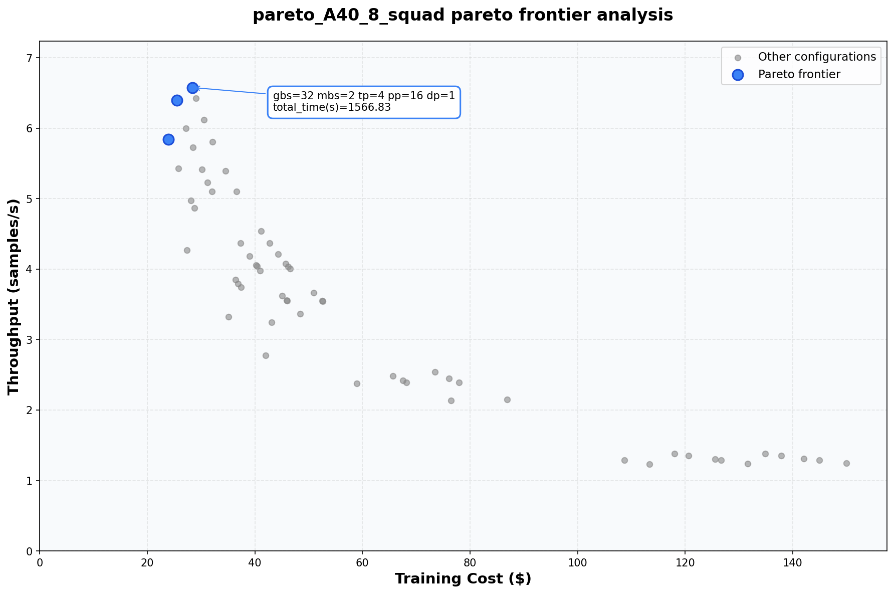
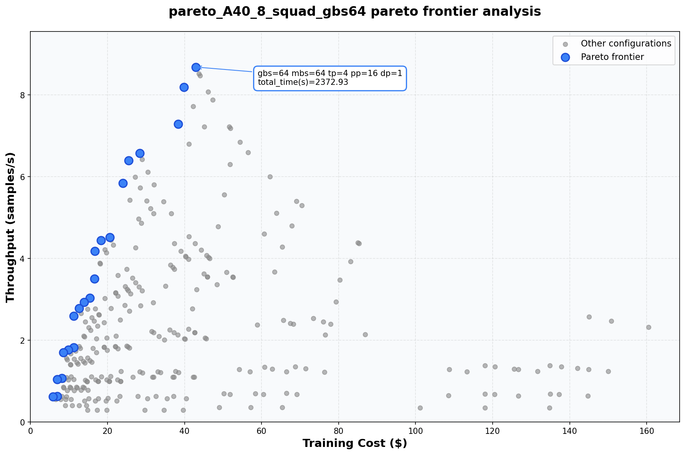

# FASOP - Fast yet Accurate automated Search for Optimal Parallelization

FASOP is a cost-based optimizer that automatically finds optimal parallelization strategies (TP, PP, DP) for Transformer-based large language model training on heterogeneous GPU clusters.

## Paper

**FASOP: Fast yet Accurate Automated Search for Optimal Parallelization of Transformers on Heterogeneous GPU Clusters**
HPDC '24: Proceedings of the 33rd International Symposium on High-Performance Parallel and Distributed Computing
https://dl.acm.org/doi/10.1145/3625549.3658687

## Directory Structure

```
fasop/
├── FASOP.py                 # Main entry: parse_arguments(), FasopConfig, SearchResult,...
├── config.py                # Configuration: GPU specs, ProfileDB, parse_gpu_cluster(),...
├── model_config.py          # LLaMA, GPT model information: get_model_config()
├── estimate.py              # Cost estimation: FASOP class, get_cost_c(), get_cost_e_fx()
├── partition.py             # PP partition logic : PartitionAlgorithm, expand_node_costs() 
├── device_placement.py      # device_placement_from_cluster(), get_all_cluster_combinations(),...
├── pipe.py                  # Pipeline modeling : Stage class, get_stage_latency(),...
├── stage.py                 # Stage-level time calculation : StageTime, PPGroup
├── utils.py                 # Utility functions : TeeLogger, JSONLLogger, factor(),...
├── make_pareto.py           # Pareto analysis and plotting : compute_pareto_frontier(),...
│
├── known_cost/              # Profile data and inspection utility
│   ├── load.py              # NPZ data viewer : show_profiles()
│   └── *.npz                # Profile data: llama70b_A40_{1,2,4,8}.npz
│
├── make_profiledb/          # FX node-based profile generation code
├── docker/                  # Docker environment for optimus_prime
├── images/                  # Generated Pareto graphs
│
└── make_profiledb_legacy/   # Legacy layer-based profiler (deprecated)
    ├── profile.py           # Profile class for layer-based DB
    ├── _06_get_layer_time.py
    └── docker/
```

## Profile Data Format

### NPZ File Format (FX Node-based)
- Shape: `(M, 10)` where M = number of mbs values
- Columns: `[embed, attn_q, attn_k, attn_v, attn_o, mlp_gate, mlp_act_fn, mlp_up, mlp_down, lm_head]`
- Rows: mbs = 1, 2, 4, 8, 16, ... (2^row_index)
- Unit: milliseconds (ms)

### File Naming Convention
```
{model}_{gpu}_{tp}.npz
Example: llama70b_A40_2.npz  (LLaMA 70B on A40 GPU with TP=2)
```

### Inspect Profile Data

Use `known_cost/load.py` to view profile data:

```bash
cd known_cost
python load.py                    # View all profiles
python load.py --dir /path/to    # Specify custom directory
```

**Example Output** (`llama70b_A40_1.npz`):
```
==========================================================================================
 PROFILE SUMMARY (ms)
==========================================================================================
TP   mbs   │      embed      layer    lm_head │      total
──────────┼──────────────────────────────────┼───────────
1    1     │       0.78      13.26      13.29 │      27.32
1    2     │       0.75      27.08      42.61 │      70.44
1    4     │       0.80      45.33      52.86 │      98.99
1    8     │       0.89      94.27     108.60 │     203.76

=====================================================================================
 LAYER BREAKDOWN (ms)
 [Q=attn_q, K=attn_k, V=attn_v, O=attn_o, gate=mlp_gate, act=mlp_act_fn, up=mlp_up, down=mlp_down]
=====================================================================================
TP  mbs         Q        K        V        O     gate      act       up     down
─────────────────────────────────────────────────────────────────────────────────────
1   1        2.78     0.16     0.14     1.18     3.00     0.04     2.96     3.00
1   2        3.60     0.29     0.27     2.20     7.21     0.09     7.08     6.36
```

## Usage

### Command Line Arguments

#### Model & Training Options
| Argument | Description | Default |
|----------|-------------|---------|
| `--gpus` | GPU cluster specification (REQUIRED). Format: `GPU_TYPE COUNT [GPU_TYPE COUNT ...]` | - |
| `--model-type` | Model type (e.g., llama70b, gpt2XL) | `llama70b` |
| `--dataset` | Dataset for training iteration calculation (squad, c4, pile, etc.) | `squad` |
| `--gbs` | Global batch size | `32` |
| `--gpu-per-node` | Number of GPUs per node | `4` |
| `--precision` | Training precision (16, 32) | `16` |

#### Search Options
| Argument | Description | Default |
|----------|-------------|---------|
| `--exhaustive` | Interactive mode: prompts user for TP, PP, DP, MBS values to evaluate specific configurations | `False` |
| `--pp-partition-method` | PP partition method: `even`, `minmax`, `dp`, `ilp`, `bruteforce` | `minmax` |

#### Pareto Options
| Argument | Description | Default |
|----------|-------------|---------|
| `--pareto` | Enable pareto experiments across cluster combinations | `False` |
| `--pareto-gbs-max` | Max GBS for pareto search (powers of 2) | `None` |
| `--make-pareto` | Generate Pareto frontier graph after search | `False` |
| `--only-make-pareto CSV_PATH` | Generate Pareto graph from existing CSV without running search | `None` |
| `--pareto-title` | Custom title and filename for Pareto graph | `None` |

#### Output Options
| Argument | Description | Default |
|----------|-------------|---------|
| `--verbose` | Enable verbose logging for partition search | `False` |
| `--log-file` | Save output log to file | `None` |
| `--add-exp-name` | Additional experiment name suffix | `""` |
| `--parsing` | Enable parsing mode for real-time JSONL output | `False` |
| `--no-save-csv` | Skip saving results to CSV file | `False` |

### Example Commands

#### Basic: Homogeneous GPU Cluster
```bash
# 8x A40 GPUs, GBS=32, squad dataset, minmax partitioning
python FASOP.py --gpus A40 8 --gbs 32 --dataset squad --pp-partition-method minmax
```

#### Change Dataset
```bash
# Using C4 dataset
python FASOP.py --gpus A40 8 --gbs 64 --dataset c4

# Using Pile dataset
python FASOP.py --gpus A100 4 --gbs 128 --dataset pile
```

#### Heterogeneous GPU Cluster
```bash
# Mixed A40 and A100 cluster
python FASOP.py --gpus A40 8 A100 1 --model-type llama70b --dataset c4
```

### Output: CSV File

Results are saved to `main_logs/` directory with the following columns:

| Column | Description |
|--------|-------------|
| `index` | Configuration index |
| `gbs`,`mbs` | Global batch size, Micro batch size |
| `tp`,`dp`,`pp` | Tensor parallelism degree, Data parallelism degree, Pipeline parallelism degree |
| `node_type` | List of GPU types per node |
| `gpu_cluster` | Cluster specification string (e.g., "A40:8") |
| `partition` | Layer partition per PP stage (list of layer counts) |
| `step_time(s)` | Estimated step time in seconds |
| `throughput(samples/s)` | Training throughput |
| `is_oom` | Whether configuration causes OOM (True/False) |
| `oom_gpumem(GB)` | Peak GPU memory usage in GB |
| `total_time(s)` | Total training time in seconds |
| `cost($)` | Total estimated training cost |
| `rank` | Ranking by throughput (lower is better) |

**Example CSV Output:**
```csv
index,gbs,mbs,tp,dp,pp,node_type,gpu_cluster,partition,step_time(s),throughput(samples/s),price_per_step($),is_oom,oom_gpumem(GB),iterations,total_time(s),total_time(h),cost($),rank
10,16,1,4,1,16.0,"['A40', 'A40', ...]",A40:8,"[41, 40, 40, ...]",4.02,3.98,0.073,False,28.16,645,2593.02,0.72,46.93,1
5,16,1,2,1,32.0,"['A40', 'A40', ...]",A40:8,"[21, 20, 20, ...]",4.26,3.76,0.077,False,34.96,645,2746.07,0.76,49.70,2
```

### Advanced Usage Scenarios

#### Scenario 1: Pareto Analysis Across Cluster Sizes

Search optimal strategies across different cluster configurations:
```bash
python FASOP.py --gpus A40 8 --pareto --dataset squad --make-pareto --pareto-title "pareto_A40_8_squad"
```
- `--pareto`: Explores all possible cluster subsets (1, 2, 3, 4, 5, 6, 7, 8 GPUs)
- `--make-pareto`: Generates Pareto frontier graph (cost vs throughput)

**Generated Pareto Graph:**



#### Scenario 2: Pareto with GBS Sweep

Search across multiple global batch sizes:
```bash
python FASOP.py --gpus A40 8 --pareto --dataset squad --pareto-gbs-max 64 --make-pareto --pareto-title "pareto_A40_8_squad_gbs64"
```
- Searches GBS = 1, 2, 4, 8, 16, 32, 64

**Generated Pareto Graph:**



#### Scenario 3: Generate Pareto Graph from Existing Results

Regenerate Pareto graph without re-running search:
```bash
python FASOP.py --only-make-pareto main_logs/llama70b_pareto.csv --pareto-title "my_analysis"
```

#### Scenario 4: Real-time Parsing Mode

For integration with external tools (real-time JSONL output):
```bash
python FASOP.py --gpus A40 4 --gbs 32 --dataset squad --parsing --no-save-csv
```

**Example Output (JSONL format):**
```json
{"type": "meta", "total_count": 53, "gbs": 32, "cluster": {"A40": 4}}
{"index": 1, "gbs": 32, "mbs": 1, "tp": 1, "dp": 1, "pp": 16.0, "node_type": ["A40", "A40", "A40", "A40"], "gpu_cluster_str": "A40:4", "partition": [41, 41, 42, 41, 40, 40, 40, 40, 40, 41, 40, 41, 40, 41, 40, 34], "step_time": 9.85014533996582, "throughput": 3.2486830290882835, "price_per_step": 0.08913287072075739, "is_oom": true, "oom_gpumem": 104.48711395263672, "iterations": 322, "total_time_seconds": 3171.746799468994, "total_time_hours": 0.8810407776302761, "cost": 28.700784372083877}
{"index": 2, "gbs": 32, "mbs": 1, "tp": 1, "dp": 2, "pp": 8.0, "node_type": ["A40", "A40", "A40", "A40"], "gpu_cluster_str": "A40:4", "partition": [82, 83, 80, 81, 80, 82, 80, 74], "step_time": 10.160629272460938, "throughput": 3.1494112364410176, "price_per_step": 0.09194240532769098, "is_oom": true, "oom_gpumem": 193.6902313232422, "iterations": 322, "total_time_seconds": 3271.722625732422, "total_time_hours": 0.9088118404812283, "cost": 29.605454515516495}
```

#### Scenario 5: Verbose Debug Mode

Detailed logging for debugging partition search:
```bash
python FASOP.py --gpus A40 4 --gbs 32 --dataset squad --verbose --no-save-csv
```

**Example Output:**
```
[SEARCH] Total combinations: 53
[SEARCH] PP Partition Method: minmax
[  1/53] MBS= 1 PP=16 DP= 1 TP=1 | searching...[  1/53] MBS= 1 PP=16 DP= 1 TP=1 | complete! 0.15s
         [41,41,...,34]          | imbal=19.94% b=2 | step=9.8501s
[  2/53] MBS= 1 PP= 8 DP= 2 TP=1 | searching...[  2/53] MBS= 1 PP= 8 DP= 2 TP=1 | complete! 0.14s
         [82,83,...,74]          | imbal=11.21% b=1 | step=10.1606s
[  3/53] MBS= 1 PP= 4 DP= 4 TP=1 | searching...[  3/53] MBS= 1 PP= 4 DP= 4 TP=1 | complete! 0.12s
         [162, 162, 162, 156]    | imbal= 3.74% b=0 | step=12.9430s
```

#### Scenario 6: Dynamic Programming Partition Method

Use DP-based optimal partitioning for balanced pipeline stages:
```bash
python FASOP.py --gpus A40 8 --gbs 32 --dataset squad --pp-partition-method dp
```
- `dp`: Dynamic programming approach to minimize stage imbalance
- Finds globally optimal partition given the cost profile
- More accurate than `minmax` but slower for large PP degrees

#### Scenario 7: ILP (Integer Linear Programming) Partition Method

Use ILP solver for optimal partitioning with constraints:
```bash
python FASOP.py --gpus A40 8 --gbs 32 --dataset squad --pp-partition-method ilp
```
- `ilp`: Uses integer linear programming to find optimal partition
- Supports additional constraints (memory limits, etc.)
- Requires `docplex` package (IBM CPLEX Python API)
- Best for complex heterogeneous cluster scenarios

**PP Partition Method Comparison:**
| Method | Speed | Optimality | Use Case |
|--------|-------|------------|----------|
| `even` | Fastest | Low | Quick baseline, Optimus-Prime style |
| `minmax` | Fast | Good | Default, balanced performance |
| `dp` | Medium | Optimal | When accuracy is important |
| `ilp` | Slow | Optimal | Complex constraints, heterogeneous clusters |
| `bruteforce` | Slowest | Optimal | Small PP degrees only (PP ≤ 8) |

## Dependencies

### Conda Environment Setup

```bash
# Install Miniforge (if not installed)
wget https://github.com/conda-forge/miniforge/releases/latest/download/Miniforge3-Linux-x86_64.sh
bash Miniforge3-Linux-x86_64.sh

# Create and activate fasop environment
conda create -n fasop python=3.12
conda activate fasop

# Install dependencies (torch CPU-only for cost estimation, no GPU required)
pip install numpy pandas matplotlib networkx pyyaml
pip install torch --index-url https://download.pytorch.org/whl/cpu
```

### Required Packages

Conda environment: `fasop` (`~/miniforge3/envs/fasop`)

| Package | Version | Note |
|---------|---------|------|
| Python  | 3.12    | |
| numpy   | 2.4.1   | |
| torch   | 2.5.1   | CPU-only (for cost estimation) |
| pandas  | 3.0.0   | |
| matplotlib | 3.10.8 | |
| networkx | 3.6.1  | |
| PyYAML  | 6.0.3   | |

## Notes

- `make_profiledb_legacy/` contains files that were previously located in `aicomp/fasop/`. These files implement layer-based profiling for generating profile databases. However, since Optimus-Prime uses FX graph models for pipeline partitioning at the operator level rather than the layer level, this approach is incompatible. Therefore, these files have been moved to the legacy directory and are no longer actively used.
- Use `make_profiledb/` for generating new profile data compatible with FX node-based partitioning.
