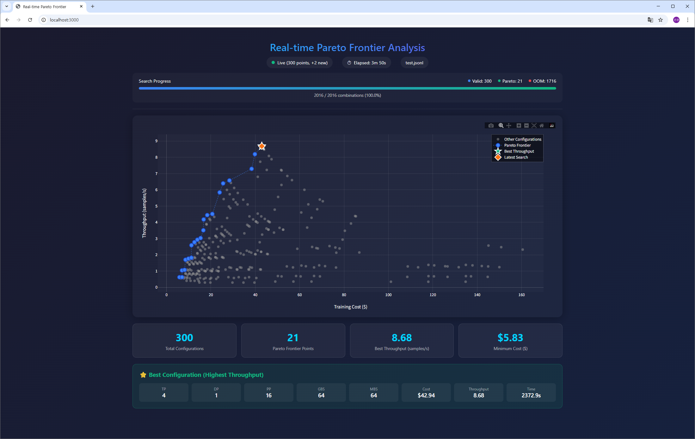

# Real-time Pareto Frontier FASOP Demo

This directory contains demo of visualizations for FASOP.

## Web Pareto Viewer

Real-time web-based Pareto frontier visualization tool that monitors FASOP search progress with interactive charts.

<p align="center">
  
</p>

### Features

- **Real-time Visualization**: Live updates as FASOP searches configurations
- **Interactive Charts**: Plotly.js-based graphs with zoom, pan, and hover tooltips
- **Progress Tracking**: Shows valid/OOM/Pareto point counts and search progress
- **Best Configuration Display**: Highlights the best throughput configuration found

### Web Viewer


### Web Interface

The web interface displays:

1. **Status Bar**: Connection status, elapsed time, data source
2. **Search Control**: Start/Stop button to control FASOP search
3. **Progress Section**:
   - Valid configurations count
   - Pareto frontier points count
   - OOM configurations count
   - Progress bar with percentage
4. **Pareto Chart**: Interactive scatter plot showing:
   - Gray dots: Non-Pareto configurations
   - Blue dots + line: Pareto frontier
   - Green star: Best throughput configuration
   - Orange diamond: Latest search result
5. **Statistics Cards**: Total configs, Pareto points, best throughput, minimum cost
6. **Best Configuration**: Detailed breakdown of the optimal configuration

### Quick Start

**Option 1: Use Built-in Search Button (Recommended)**

```bash
# Start the web viewer from demo/ directory
cd demo
python web_pareto_viewer.py

# Open http://localhost:3000 and click the "Search" button
# FASOP will automatically run from the parent directory
```

**Option 2: Run FASOP Separately**

```bash
# Terminal 1: Run FASOP with --parsing flag (from fasop/ directory)
python FASOP.py --gpus A40 8 --pareto --parsing --pareto-gbs-max 64 --parsing-file test.jsonl

# Terminal 2: Launch web viewer (from demo/ directory)
cd demo
python web_pareto_viewer.py
# The viewer will automatically monitor ../test.jsonl
```
Note: When using the Search button, FASOP runs from the parent directory (`fasop/`) with the default command:
```bash
python FASOP.py --gpus A40 8 --model-type llama70b --dataset squad \
    --pareto --pareto-gbs-max 64 --parsing --parsing-file test.jsonl --no-save-csv
```
### Usage

```bash
python web_pareto_viewer.py [OPTIONS]
```

### Options

| Option | Description | Default |
|--------|-------------|---------|
| `-p, --port` | Server port | `3000` |
| `-f, --data-file` | Local JSONL file to monitor | `test.jsonl` |
| `-u, --data-url` | URL to fetch data from (alternative to file) | - |


### Data Format

The viewer expects JSONL (JSON Lines) format from FASOP's `--parsing` mode:

```json
{"type": "meta", "total_count": 53, "gbs": 32, "cluster": {"A40": 8}}
{"index": 1, "gbs": 32, "mbs": 1, "tp": 1, "dp": 1, "pp": 16, "cost": 46.93, "throughput": 3.98, "is_oom": false}
{"index": 2, "gbs": 32, "mbs": 1, "tp": 2, "dp": 1, "pp": 8, "cost": 49.70, "throughput": 3.76, "is_oom": false}
```

### Requirements

- Python 3.8+
- numpy
- Modern web browser (Chrome, Firefox, Safari, Edge)

No additional Python dependencies required - uses built-in `http.server` and Plotly.js CDN.

### Files

| File | Description |
|------|-------------|
| `web_pareto_viewer.py` | Web server and visualization tool |
| `pareto_viewer.png` | Screenshot of the web interface |
| `Optimus-Prime-FASOP-Demo.gif` | Animated demo of FASOP search |
| `Optimus-Prime-FASOP-Demo.mp4` | Full demo video |
